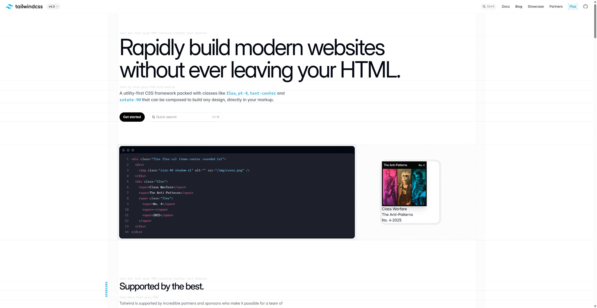
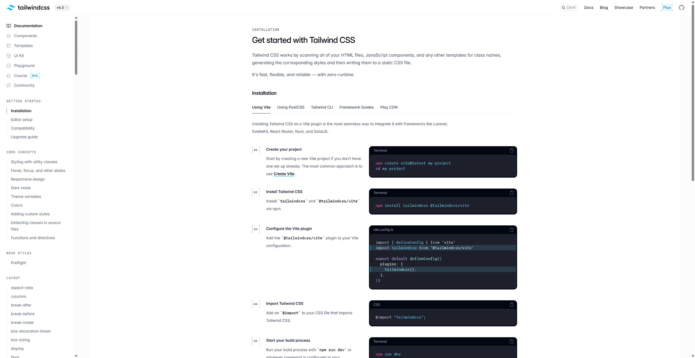
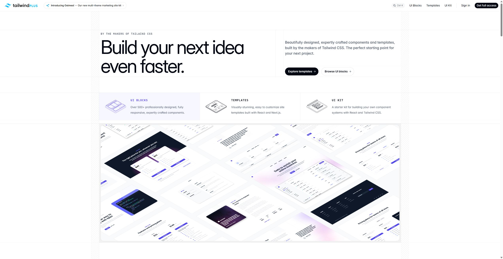
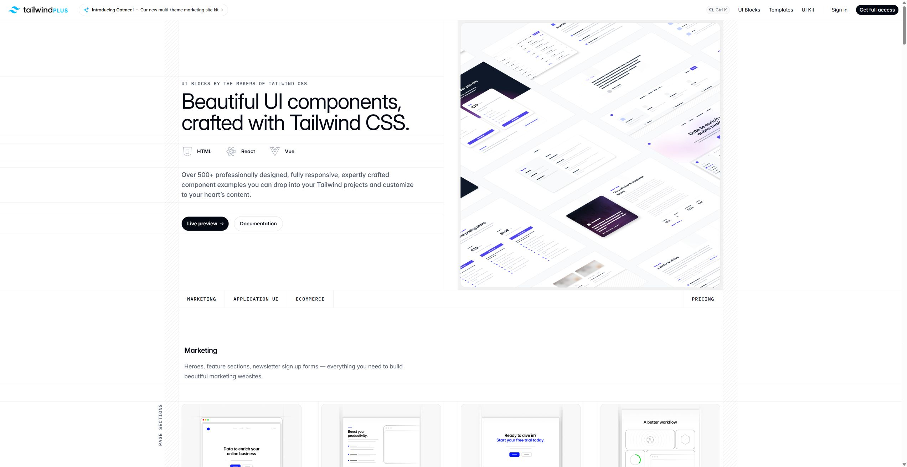
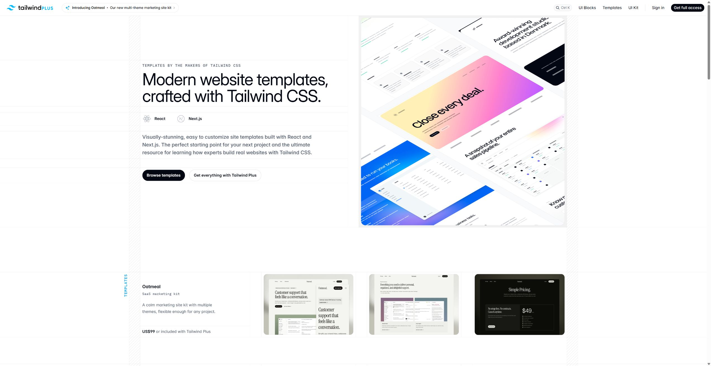
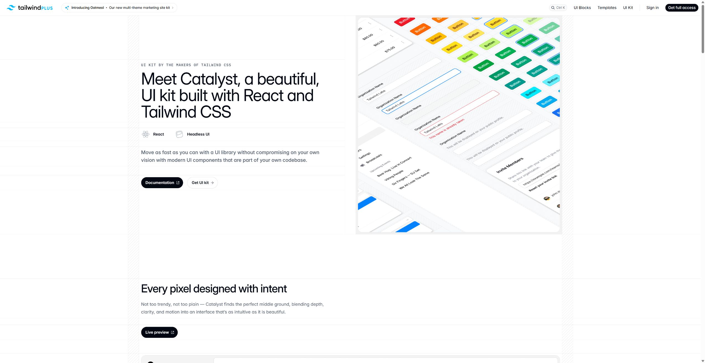

# Tailwind CSS / Tailwind Plus 사이트 구조 분석

> 조사일: 2026-06-30  
> 목적: UI Vocabulary 사이트의 `Docs`와 `Plus` 분리를 설계하기 위해 Tailwind 공식 사이트의 페이지 구조, 탐색 체계, 공개 클라이언트 코드/자산 배치를 분석한다.  
> 범위: 공식 웹사이트에서 내려받을 수 있는 HTML, 클라이언트 번들 경로, DOM 데이터, 브라우저 스크린샷 기준. 비공개 원본 저장소 코드는 분석 대상이 아니다.

## 조사 대상

| 구분 | URL | 로컬 스크린샷 |
| --- | --- | --- |
| Tailwind home | <https://tailwindcss.com/> |  |
| Tailwind docs | <https://tailwindcss.com/docs> |  |
| Tailwind Plus | <https://tailwindcss.com/plus> |  |
| Plus UI Blocks | <https://tailwindcss.com/plus/ui-blocks> |  |
| Plus Templates | <https://tailwindcss.com/plus/templates> |  |
| Plus UI Kit | <https://tailwindcss.com/plus/ui-kit> |  |

## 큰 구조

Tailwind 사이트는 한 사이트 안에서 성격이 다른 표면을 분리한다.

1. **Home**: 제품의 정체성과 진입 라우터다. `Docs`, `Blog`, `Showcase`, `Partners`, `Plus`, `Get started`로 사용자를 나눈다.
2. **Docs**: Tailwind CSS 자체를 배우고 참조하는 기술 문서다. 좌측 사이드바는 개념과 CSS 속성군 중심이다.
3. **Plus**: 유료 예시 자산과 완성 UI의 카탈로그다. `UI Blocks`, `Templates`, `UI Kit`을 별도 제품 라인처럼 보여준다.
4. **UI Blocks**: 화면 조각 단위의 카탈로그다. `Marketing`, `Application UI`, `Ecommerce`라는 사용 맥락을 먼저 고르고, 그 아래에서 실제 UI 덩어리를 찾게 한다.
5. **Templates**: 완성 사이트/앱 템플릿 카탈로그다. 여기서는 분류어보다 템플릿 이름과 미리보기 카드가 중심이다.
6. **UI Kit**: Catalyst라는 React UI kit의 랜딩/문서 허브다. 개별 컴포넌트 문서로 연결된다.

핵심은 `Docs = 개념/사용법`, `Plus = 만들 수 있는 화면 예시/제품 자산`의 분리다. 둘은 같은 브랜드를 쓰지만 탐색 기준과 페이지 역할이 다르다.

## Home

Home의 역할은 문서도 카탈로그도 아니라, Tailwind라는 제품의 첫 인상과 분기점이다.

- 첫 화면은 제품 약속을 크게 제시한다.
- 상단 탐색은 `Docs`, `Blog`, `Showcase`, `Partners`, `Plus`, `Get started`처럼 목적별 출구를 둔다.
- 중간 섹션은 기능 설명과 사용 예시를 섞어 신뢰를 만든다.
- 하단은 Tailwind CSS 리소스와 Tailwind Plus 리소스를 다시 묶는다.

우리 사이트에 바로 대응시키면 Home은 `UI 용어 사전`의 가치 설명보다 `Docs로 볼지`, `Plus식 예시 카탈로그로 볼지`, `전체 인덱스로 볼지`를 안내하는 라우터가 되어야 한다.

## Docs

Docs는 학습/참조 문서로 설계되어 있다.

좌측 사이드바의 큰 그룹은 다음처럼 구성된다.

- `Getting started`
- `Core concepts`
- `Base styles`
- `Layout`
- `Flexbox & Grid`
- `Spacing`
- `Sizing`
- `Typography`
- `Backgrounds`
- `Borders`
- `Effects`
- `Filters`
- `Tables`
- `Transitions & Animation`
- `Transforms`
- `Interactivity`
- `SVG`
- `Accessibility`

이 분류는 UI 화면의 종류가 아니라 Tailwind CSS를 쓰는 사람이 찾는 **개념/속성군**이다. 예를 들어 `Layout`, `Spacing`, `Typography`, `Accessibility`는 화면 맥락이 아니라 구현자가 문제를 해결할 때 찾는 레퍼런스 축이다.

우리 사이트의 `Docs`도 이 성격을 가져야 한다.

- `레이아웃`, `타이포그래피`, `색상/표면`, `상태/인터랙션`, `접근성`, `모션/효과`처럼 개념군으로 묶는다.
- 각 용어는 짧은 정의, 왜 쓰는지, 예시, 관련 용어로 이어진다.
- `Hero section`, `Checkout page`, `Command palette` 같은 화면/블록명은 Docs에만 고정하지 않고 Plus식 예시 카탈로그에서도 접근 가능하게 둔다.

## Plus

Tailwind Plus는 Tailwind CSS 문서와 다른 앱 표면으로 보인다. 공개 HTML 기준으로 `id="app"` 루트와 `data-page`에 페이지 props가 들어 있고, 자산 경로도 `plus-assets/build/assets`로 분리된다.

Plus 랜딩은 유료 자산의 허브다.

- 상단 탐색은 `UI Blocks`, `Templates`, `UI Kit`, `Sign in`, `Get full access`로 구성된다.
- 본문은 `UI Blocks`, `Templates`, `UI Kit`, 가격, FAQ 같은 구매/탐색 흐름을 가진다.
- Footer도 Tailwind CSS 문서와 다르게 Plus 자산 중심으로 묶인다.

우리 사이트의 `Plus`는 유료 상품이라는 의미를 복사할 필요는 없다. 대신 Tailwind Plus처럼 **"화면을 만들기 위한 실전 예시 카탈로그"**로 쓰면 된다.

## Plus UI Blocks

UI Blocks는 가장 중요한 레퍼런스다. 분류가 사용자의 의도와 직접 맞닿아 있다.

공개 `data-page`에서 확인한 상위 제품 축은 세 개다.

| 상위 축 | 그룹 수 | 하위 카테고리 수 | 그룹 |
| --- | ---: | ---: | --- |
| Marketing | 4 | 23 | Page Sections, Elements, Feedback, Page Examples |
| Application UI | 11 | 49 | Application Shells, Headings, Data Display, Lists, Forms, Feedback, Navigation, Overlays, Elements, Layout, Page Examples |
| Ecommerce | 2 | 21 | Components, Page Examples |

이 구조에서 중요한 점은 `Marketing`, `Application UI`, `Ecommerce`가 **주제**가 아니라 **사용 맥락/제품 맥락**이라는 것이다. 사용자는 "나는 어떤 화면을 만들고 있나?"로 먼저 들어간다.

예시:

- Marketing: `Hero Sections`, `Feature Sections`, `CTA Sections`, `Bento Grids`, `Pricing Sections`, `Header Sections`, `Newsletter Sections`, `Stats`, `Testimonials`, `Blog Sections`, `Contact Sections`, `Team Sections`, `Content Sections`, `Logo Clouds`, `FAQs`, `Footers`
- Application UI: `Application Shells`, `Page Headings`, `Tables`, `Form Layouts`, `Input Groups`, `Select Menus`, `Alerts`, `Navbars`, `Pagination`, `Tabs`, `Command Palettes`, `Modal Dialogs`, `Drawers`, `Avatars`, `Badges`, `Buttons`, `Cards`
- Ecommerce: `Product Overviews`, `Product Lists`, `Shopping Carts`, `Category Filters`, `Product Quickviews`, `Checkout Forms`, `Reviews`, `Order Summaries`, `Storefront Pages`, `Product Pages`, `Checkout Pages`

우리 사이트에서 이전에 쓰던 `주제별/형태별/상황별`은 이 기준에 비해 추상적이다. 사용자가 "주제"라는 말을 듣고 `Marketing`인지 `Layout`인지 `Component`인지 바로 이해하기 어렵다. Tailwind식으로 바꾸면 다음이 더 선명하다.

- `Docs`: 개념/속성/원리 중심
- `Blocks`: 화면 조각 중심
- `Examples`: 완성 화면/패턴 중심
- `Contexts`: Marketing, Application UI, Ecommerce 같은 사용 맥락

## Plus Templates

Templates는 UI Blocks와 다르게 카테고리 학습보다 완성품 선택이 중심이다.

- 카드에는 템플릿 이름, 미리보기, 용도가 먼저 보인다.
- `Oatmeal`, `Spotlight`, `Radiant`, `Compass`, `Salient`, `Studio`, `Primer`, `Protocol`, `Commit`, `Transmit`, `Pocket`, `Syntax`, `Keynote` 같은 고유 템플릿 이름이 제품 단위가 된다.
- 사용자는 "어떤 구성요소를 찾는다"보다 "이런 완성 사이트를 시작점으로 쓰겠다"는 모드로 들어온다.

우리 사이트에 그대로 대응하면 `Templates`는 당장 만들 필요는 없지만, 나중에 `Dashboard example`, `SaaS landing example`, `Checkout flow example`처럼 완성 화면 묶음을 둘 때 적합하다.

## Plus UI Kit

UI Kit은 Catalyst라는 React UI kit의 소개/문서 허브다. 이 페이지는 카탈로그라기보다 "컴포넌트 시스템"의 진입점이다.

연결되는 컴포넌트 문서 축은 다음과 같다.

- Basic controls: `Button`, `Input`, `Textarea`, `Checkbox`, `Radio groups`, `Switch`
- Choice/navigation: `Combobox`, `Listbox`, `Dropdown`, `Pagination`, `Navbar`, `Sidebar`
- Data/display: `Table`, `Description list`, `Badge`, `Avatar`, `Divider`, `Heading`, `Text`
- Feedback/layout: `Alert`, `Dialog`, `Sidebar layout`, `Stacked layout`, `Auth layout`

우리 사이트에서는 `UI Kit`에 해당하는 표면을 별도 페이지로 만들기보다, 각 term 상세에서 "이 용어가 실제 컴포넌트 시스템에서는 어디에 들어가는가"를 보여주는 보조 축으로 쓰는 편이 현실적이다.

## 공개 코드/자산 배치

분석한 공개 HTML과 자산 경로 기준으로 다음 신호가 확인된다.

### Tailwind home/docs

- `/_next/static/chunks/...` 경로의 JS chunk를 사용한다.
- `turbopack` 이름이 포함된 chunk가 있다.
- 스타일시트는 `/_next/static/chunks/...css` 형태다.
- Home과 Docs는 같은 Next 계열 사이트 표면으로 보인다.

### Tailwind Plus

- HTML 루트에 `id="app"`와 `data-page`가 있으며, 페이지 component 이름과 props가 들어 있다.
- 주요 자산은 `https://tailwindcss.com/plus-assets/build/assets/app-C2aoSx2g.js`, `client-qyRSZoVl.js`, `app-D5DVLQNa.css`처럼 `plus-assets` 아래에서 로드된다.
- `data-page` 구조와 앱 번들 문자열 기준으로 Inertia 계열 클라이언트 앱 신호가 있다.
- 외부 리소스로 Inter font, Google Tag Manager, Paddle 결제 스크립트가 붙는다.

이것은 Tailwind가 "문서 사이트"와 "Plus 제품 카탈로그"를 같은 브랜드 아래 두되, 구현 표면과 탐색 체계를 분리했다는 근거다.

## 우리 사이트에 적용할 결론

현재 우리 페이지는 이미 `Docs / Plus / Index` 분기와 `?page=docs`, `?page=plus`, `?page=index` URL을 갖기 시작했다. 다음 단계는 단순 탭 분리를 넘어 Tailwind식 역할을 분명히 하는 것이다.

1. `Docs`는 개념 사전으로 둔다. `Layout`, `Styling`, `Interaction`, `Accessibility`, `Motion/Effects`처럼 구현자가 찾는 개념군을 기준으로 정리한다.
2. `Plus`는 예시 카탈로그로 둔다. `Marketing`, `Application UI`, `Ecommerce` 같은 화면 맥락을 먼저 보여주고, 그 안에 `Hero`, `Forms`, `Navigation`, `Overlays`, `Cards`, `Tables`, `Checkout` 같은 실제 블록을 둔다.
3. `Index`는 전체 검색/전체 용어 표면으로 둔다. Docs와 Plus 어디에 있든 모든 term을 빠르게 찾는 백업 경로다.
4. 같은 용어가 Docs와 Plus에 모두 나타나는 것은 정상이다. 단, Docs에서는 "정의/원리"로 설명하고 Plus에서는 "어떤 화면에서 쓰이는 예시"로 보여준다.
5. 좌측 사이드바 문구는 `주제별/형태별/상황별` 같은 추상어보다 `Docs`, `Blocks`, `Examples`, `Contexts`처럼 사용자가 행동을 예측할 수 있는 이름으로 바꾼다.

## 다음 구현 계획

1. `Docs` 사이드바를 개념군 중심으로 재정리한다.
2. `Plus` 사이드바를 Tailwind Plus처럼 `Marketing`, `Application UI`, `Ecommerce` 상위 맥락으로 재정리한다.
3. 각 용어에 `docsGroups`와 `plusContexts`를 분리해서 부여한다. 같은 term이 두 표면에 중복 노출되는 것을 데이터 모델에서 허용한다.
4. `Plus` 첫 화면에는 전체 용어 카드가 아니라 맥락별 대표 블록 카드를 먼저 보여준다.
5. 상세 페이지에는 `Docs 위치`와 `Plus 예시 위치`를 breadcrumb처럼 동시에 보여준다.

