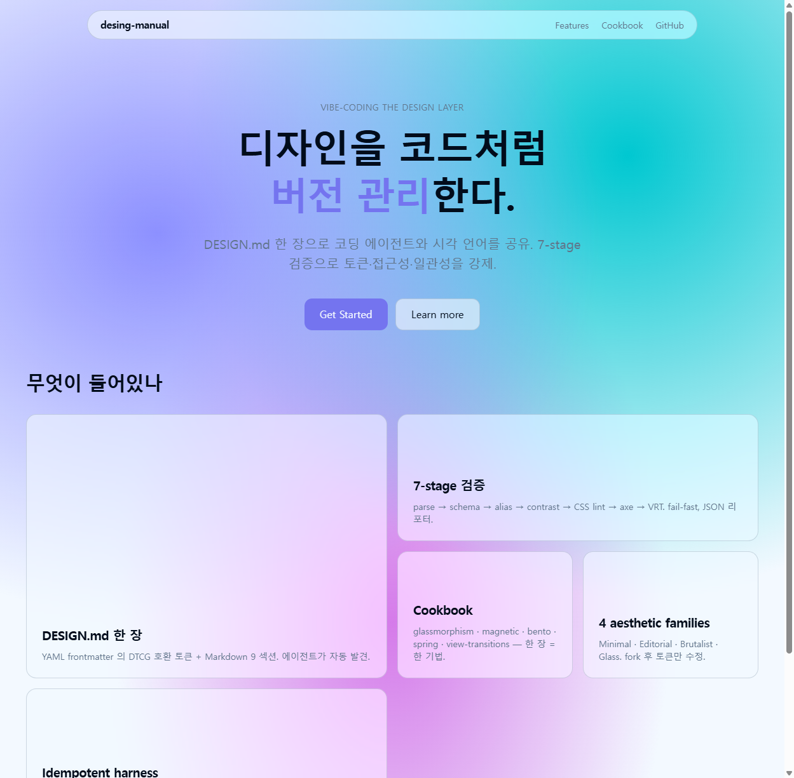
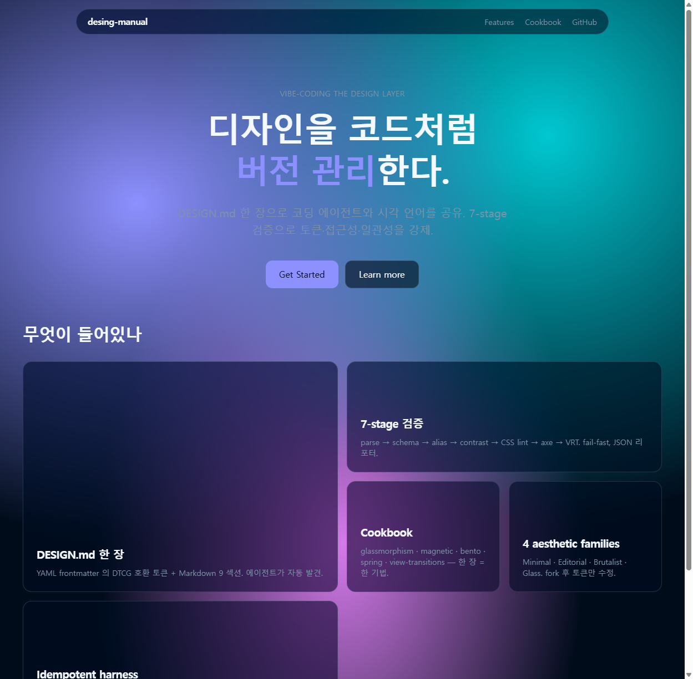

# glass-landing

> `desing-manual` 의 첫 conformance fixture. Glass aesthetic family 기반 landing page.

| Light | Dark |
|---|---|
|  |  |

다크 모드는 `themes.dark` 블록(DESIGN.md frontmatter)이 자동으로 `@media (prefers-color-scheme: dark)` 와 `[data-theme="dark"]` 두 가지 CSS rule 로 emit 되어 동작.

## 실행

```bash
cd examples/glass-landing
npm install
npm run build:design   # DESIGN.md → src/theme.generated.css (Tailwind @theme)
npm run dev            # http://localhost:5173
npm run build && npm run preview
```

`src/theme.generated.css` 는 gitignored. DESIGN.md 변경 시 `npm run build:design` 재실행 (CI 에선 자동).

## 검증

```bash
npm run lint:design        # DESIGN.md 4단계 (parse/schema/alias/contrast)
npm run lint:css           # stylelint
npm run lint:js            # eslint-plugin-tailwindcss
npm run test:vrt           # Playwright VRT (light/dark × hero/full + a11y + magnet)
npm run test:vrt:update    # baseline 갱신 (의도된 디자인 변경 시)
# 산출: .design/*.json
```

VRT baseline 은 `tests/design.spec.ts-snapshots/` 에 git 추적. PR 에서 diff 가 생기면
의도된 변경인지 사람이 확인 후 `--update-snapshots` 로 갱신.

## 행사하는 기법

| Cookbook 항목 | 사용처 |
|---|---|
| [glassmorphism](../../cookbook/effects/glassmorphism.md) | `GlassNav`, `Hero` "Learn more", `FeatureBento` 카드 |
| [gradient-mesh](../../cookbook/effects/gradient-mesh.md) | `theme.css` body 배경 |
| [magnetic-button](../../cookbook/interactions/magnetic-button.md) | `Hero` "Get Started" |
| [bento-grid](../../cookbook/layouts/bento-grid.md) | `FeatureBento` (4 컬럼, feature 카드 2×2) |
| [spring-easing](../../cookbook/motion/spring-easing.md) | 카드 hover, magnetic reset |
| [focus-visible](../../cookbook/interactions/focus-visible.md) | `theme.css` :where 셀렉터 |

## DESIGN.md 흐름

```
DESIGN.md  (DTCG 토큰 + themes 블록)
   │
   ↓  scripts/lint/build.js  (자동)
src/theme.generated.css  @theme { ... } + dark overrides
   │
   ↓  Tailwind v4 가 자동 인식
*.tsx  className="bg-(--color-action-primary) ..."
```

`base.css` 는 토큰 너머의 스타일(body 배경, focus-visible, prefers-reduced-transparency) — 손으로 유지.

## 알려진 한계 / TODO

- [x] DESIGN.md → theme.css 자동 빌드 스크립트
- [x] `prefers-color-scheme: dark` + `[data-theme="dark"]` 토글 둘 다 지원
- [x] Playwright `tests/design.spec.ts` baseline 캡처 (6 tests, light/dark × hero/full + a11y + magnet hover)
- [x] dark mode action.primary contrast (iris-500 → iris-400 override; lint 강화로 미연 방지)
- [ ] glass 위 *동적 배경* (gradient mesh 위) 텍스트 contrast — 픽셀 샘플 측정으로 보강
