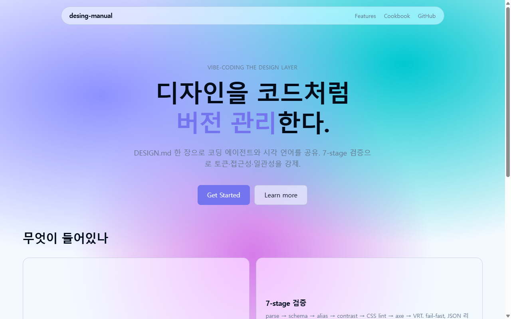

# glass-landing

> `desing-manual` 의 첫 conformance fixture. Glass aesthetic family 기반 landing page.



## 실행

```bash
cd examples/glass-landing
npm install
npm run dev          # http://localhost:5173
npm run build && npm run preview
```

## 검증

```bash
npm run lint:design  # DESIGN.md 4단계 (parse/schema/alias/contrast)
npm run lint:css     # stylelint
npm run lint:js      # eslint-plugin-tailwindcss
# 산출: .design/*.json
```

## 행사하는 기법

| Cookbook 항목 | 사용처 |
|---|---|
| [glassmorphism](../../cookbook/effects/glassmorphism.md) | `GlassNav`, `Hero` "Learn more", `FeatureBento` 카드 |
| [gradient-mesh](../../cookbook/effects/gradient-mesh.md) | `theme.css` body 배경 |
| [magnetic-button](../../cookbook/interactions/magnetic-button.md) | `Hero` "Get Started" |
| [bento-grid](../../cookbook/layouts/bento-grid.md) | `FeatureBento` (4 컬럼, feature 카드 2×2) |
| [spring-easing](../../cookbook/motion/spring-easing.md) | 카드 hover, magnetic reset |
| [focus-visible](../../cookbook/interactions/focus-visible.md) | `theme.css` :where 셀렉터 |

## DESIGN.md 흐름

```
DESIGN.md (DTCG 토큰)
   │
   ↓  (수동 동기화 — 후속 작업: build.js 가 자동화)
src/theme.css  @theme { ... }
   │
   ↓  (Tailwind v4 가 자동 인식)
*.tsx  className="bg-(--color-action-primary) ..."
```

토큰 변경은 항상 DESIGN.md 먼저, 그다음 `theme.css` 동기화. lint 가 잡지는 못함 (build 스크립트 후속 작업).

## 알려진 한계 / TODO

- [ ] DESIGN.md → theme.css 자동 빌드 스크립트 (`scripts/lint/build.js`)
- [ ] Playwright `tests/design.spec.ts` baseline 캡처
- [ ] `prefers-color-scheme: dark` 적용
- [ ] glass 위 텍스트 contrast 수동 측정 결과 박기 (lint 가 못 잡음)
